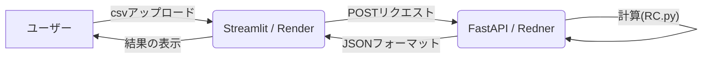

# 概要

ユーザーがアップロードしたcsv形式の野球の打者成績のファイルからチームの得点数を予測する指標であるRC(Runs Created）を計算し、その結果を返すものです。

# RC

RCは以下の計算式で定義されています

*RC = (安打＋四球）×塁打÷（打数＋四球）*

ビル・ジェームズによって提唱されたRCは高い精度でチームの得点数を予測できます。（おおよそ9割)  
この計算式を個人の選手の成績に適用することで、選手を『得点創造力』といった新たな観点から評価することができるようになります。  

# webサイトへのアクセス  

以下のリンクからサイトにアクセスすることができます。

[こちら](https://file-api-f40b.onrender.com)

# 使用技術一覧  

# システム構成図

# データの出典

本プロジェクトで使用することができるデータは以下のサイトより取得,引用させていただいております。  

[プロEYE球](https://proeyekyuu.com/ja/home-jp/)  

# 今後の展望  

DBの追加、コードのリファクタリング、webセキュリティ、新たな機能の追加などを目標にバックエンド中心で進めていきたいと考えています。  

# 参考書籍

- 蛭川　晧平(2019)『セイバーメトリクス入門』水曜社
